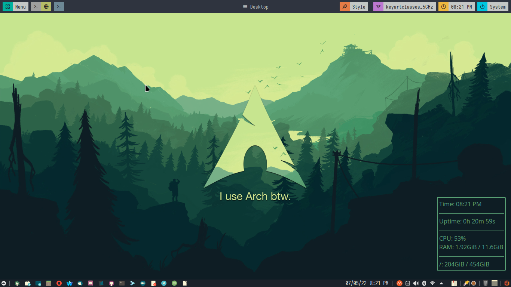
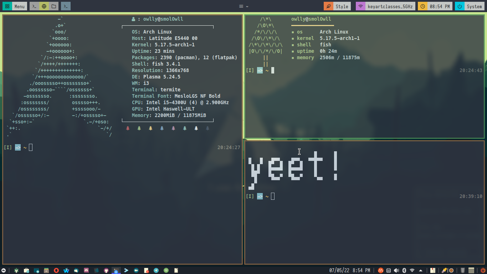
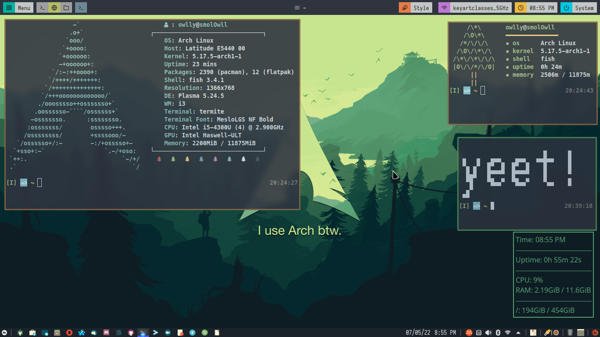
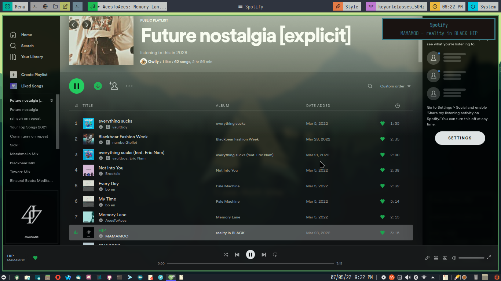
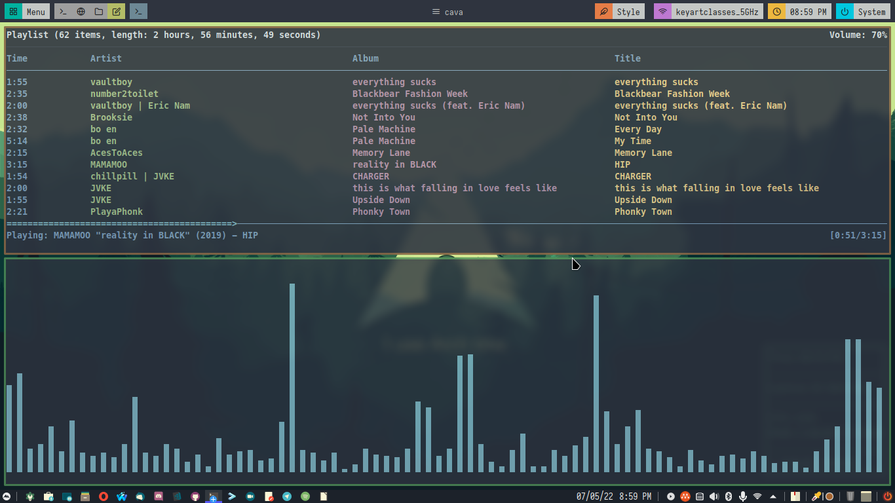

# :owl: Owlly's dotfiles (managed by chezmoi)

image 1: Background

image 2: Termite Terminals (Tiled)

image 3: Termite Terminals (Floating)

image 4: Spotify (Customized by [spicetify](https://github.com/khanhas/spicetify-cli))

image 5: [ncmpcpp](https://github.com/ncmpcpp/ncmpcpp) (Music Player) & [cava](https://github.com/karlstav/cava) (Audio Visualizer)

|Other Things|
|:---------------:|
|[neofetch](https://github.com/dylanaraps/neofetch)|
|[treefetch](https://github.com/angelofallars/treefetch)|
|[TOIlet](https://github.com/cacalabs/toilet)|
|[polybar](https://github.com/polybar/polybar) ([the themes](https://github.com/adi1090x/polybar-themes))|
|[rofi](https://github.com/davatorium/rofi) ([the themes](https://github.com/adi1090x/rofi))|
|[conky](https://github.com/brndnmtthws/conky)|

# :fish: Shell
I use fish but before i used bash so i also added my [.bashrc](dot_bashrc) & [.bash_aliases](dot_bash_aliases)

# 💻 Terminal
Termite is really cool

# 🪟 DE/WE

i3+KDE but i also have awesomewm (I will configure it later)

# 👏 And that's it
